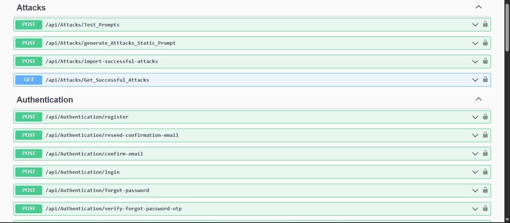
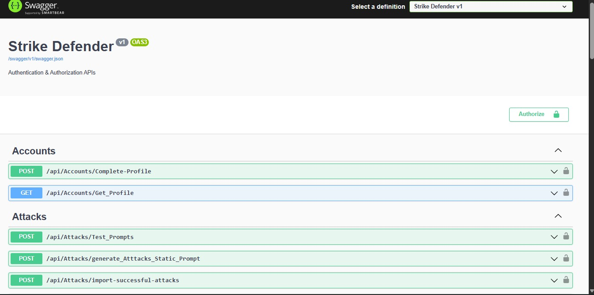

# Strike Defender 🛡️

### AI-Powered Adaptive Firewall & Attack Intelligence Platform

Strike Defender is an intelligent cybersecurity platform designed to automatically discover, analyze, and defend against web application attacks using AI-driven attack generation, sandbox testing, and adaptive firewall rule creation.

The system continuously learns from successful attacks and generates new security rules to strengthen protection against evolving threats.

---

# 📌 Project Overview

Strike Defender combines Artificial Intelligence, Cybersecurity Automation, and Adaptive Firewall Management into a unified platform.

The system automatically:

1. Generates attack payloads using AI.
2. Executes attacks inside an isolated sandbox environment.
3. Detects attacks that bypass current firewall protections.
4. Analyzes successful attacks.
5. Generates new firewall rules using AI.
6. Updates the firewall configuration automatically.
7. Stores attacks, rules, and analytics for monitoring and reporting.

---

# 🏗️ System Architecture

```text
┌─────────────────────┐
│ AI Attack Generator │
└──────────┬──────────┘
           │
           ▼
┌─────────────────────┐
│ Attack Orchestrator │
└──────────┬──────────┘
           │
           ▼
┌─────────────────────┐
│ Sandbox Environment │
│ Vulnerable Website  │
│ Vulnerable Database │
└──────────┬──────────┘
           │
           ▼
┌─────────────────────┐
│ Firewall Evaluation │
└──────────┬──────────┘
           │
           ▼
┌─────────────────────┐
│ Attack Analysis     │
└──────────┬──────────┘
           │
           ▼
┌─────────────────────┐
│ AI Rule Generator   │
└──────────┬──────────┘
           │
           ▼
┌─────────────────────┐
│ Adaptive Firewall   │
└──────────┬──────────┘
           │
           ▼
┌─────────────────────┐
│ Dashboard & Reports │
└─────────────────────┘
```

---

# 🎯 Core Objectives

* Automate penetration testing workflows.
* Discover firewall weaknesses.
* Build self-improving security rules.
* Reduce manual security operations.
* Provide attack intelligence and analytics.
* Improve web application protection continuously.

---

# 🤖 AI Integration

The platform integrates with Large Language Models (LLMs) to perform:

### Attack Generation

Generate multiple attack payloads including:

* SQL Injection (SQLi)
* Cross-Site Scripting (XSS)
* Prompt Injection
* Command Injection
* Path Traversal
* Authentication Bypass Attempts

### Rule Generation

When attacks successfully bypass the firewall:

* Successful attacks are collected.
* Similar attacks are grouped.
* AI generates generalized firewall rules.
* Rules are reviewed and stored.
* Firewall configurations are updated.

---

# 🔐 Adaptive Firewall Engine

The firewall continuously evolves based on attack outcomes.

### Responsibilities

* Store generated rules.
* Validate generated rules.
* Apply rules to firewall configuration.
* Prevent duplicate rules.
* Track rule effectiveness.
* Maintain rule history.

---

# 🧪 Sandbox Environment

All generated attacks are executed inside an isolated testing environment.

### Components

* Vulnerable Web Application
* Vulnerable API Endpoints
* Test Database
* Firewall Layer
* Monitoring Service

### Purpose

* Safe attack execution.
* Firewall effectiveness testing.
* Attack success tracking.
* Data collection for AI analysis.

---

# ⚙️ Automation Pipeline

The entire workflow is automated.

```text
Generate Attacks
       ↓
Execute in Sandbox
       ↓
Collect Results
       ↓
Analyze Successful Attacks
       ↓
Generate New Rules
       ↓
Update Firewall
       ↓
Store Analytics
```

---

# 📊 Attack Analytics & Intelligence

The platform collects and analyzes:

* Successful attacks
* Blocked attacks
* Attack categories
* Attack frequency
* Rule effectiveness
* Firewall performance
* AI-generated rule history

---

# 🖥️ Dashboard Features

The administration dashboard provides:

### Security Monitoring

* Live attack monitoring
* Firewall statistics
* Security reports
* Rule management

### Attack Intelligence

* Attack history
* Attack categories
* Successful attack analysis
* Generated payload review

### Rule Management

* Generated rules
* Rule approval
* Rule activation
* Rule versioning

### System Administration

* User management
* Logs management
* AI activity tracking
* Sandbox monitoring

---

# 🌐 Public Website

The platform includes a public website where organizations can:

* Learn about the platform.
* Purchase firewall protection.
* Access security services.
* View product information.
* Contact the security team.

---

# 🛠️ Tech Stack

## Backend

* ASP.NET Core
* Clean Architecture
* CQRS
* MediatR
* Entity Framework Core
* SQL Server
* FluentValidation
* JWT Authentication
* Rate Limiting

## AI & Automation

* LLM Integration
* Prompt Engineering
* Automated Attack Generation
* Automated Rule Generation

## Cybersecurity

* Adaptive Firewall Engine
* Sandbox Execution
* Attack Analysis
* Security Monitoring

## Dashboard

* REST APIs
* Role-Based Authorization
* Analytics & Reporting

---

# 🚀 Key Backend Contributions

### AI Workflow Integration

* Built API integrations with AI services.
* Automated attack generation requests.
* Customized AI responses.
* Generated firewall rule requests dynamically.

### Cybersecurity Automation

* Automated attack execution workflows.
* Integrated sandbox communication APIs.
* Managed attack processing pipelines.

### Attack Analysis Engine

* Processed successful attacks.
* Applied filtering and categorization.
* Stored attack intelligence data.
* Prepared analytics for dashboard reporting.

### Performance Optimization

* Implemented Rate Limiting on generation endpoints.
* Protected AI quotas.
* Prevented abuse and excessive requests.

---

# 📷 System Screenshots

## ERD

> Add ERD Diagram Here


---

## Swagger Documentation

> Add Swagger Screenshots Here






---

## Dashboard

> Add Dashboard Screenshots Here


---

## Analytics

> Add Analytics Screenshots Here


---

# 👨‍💻 Team

Graduation Project — Faculty of Computers & Artificial Intelligence

Backend Developer: **Ahmed Momtaz**

---

# 📄 License

This project was developed for educational and graduation purposes. It demonstrates the integration of AI, Cybersecurity Automation, Adaptive Firewalls, and Modern Backend Engineering principles.
