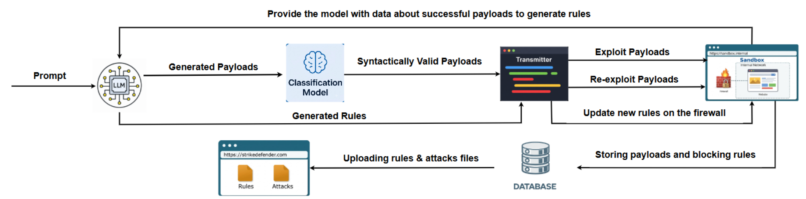
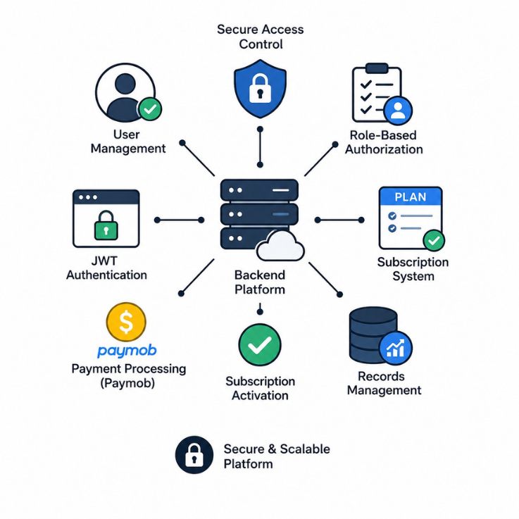
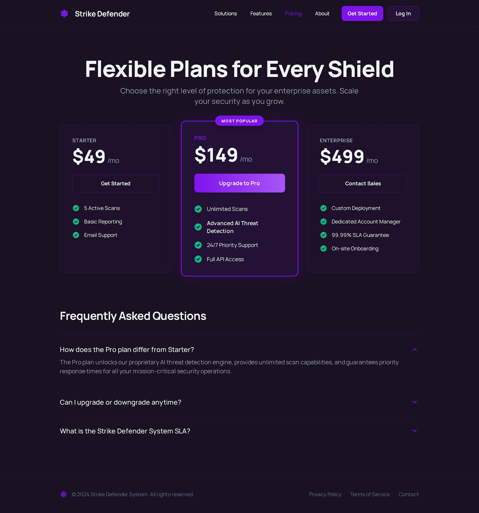
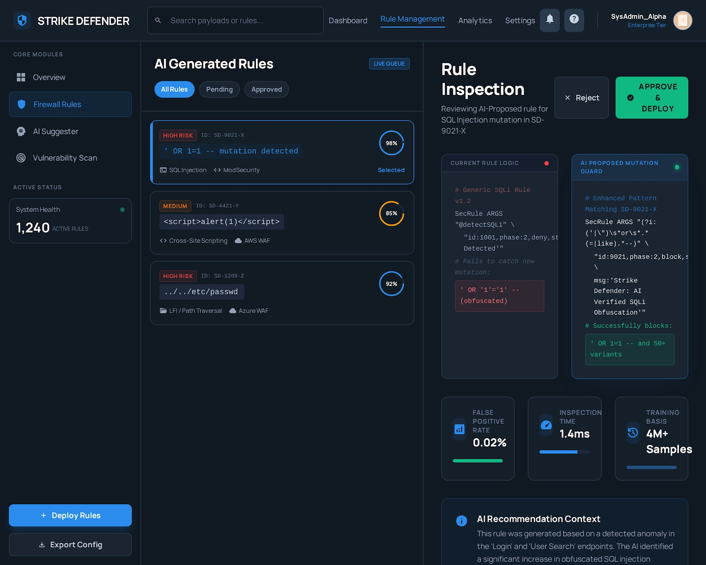
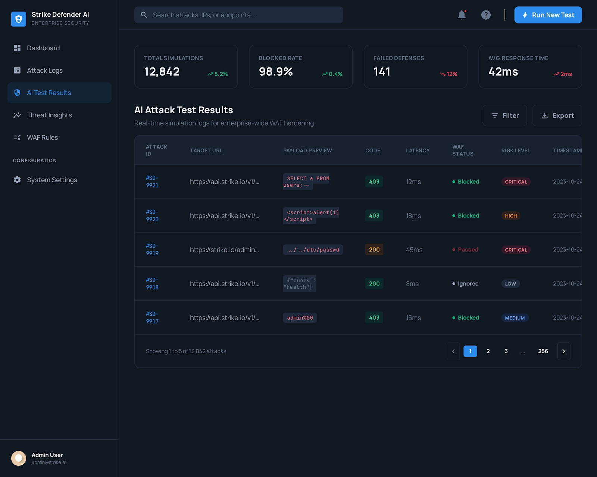

<p align="center">
  
</p>
<h1 align="center">🛡️ Strike Defender</h1>

<p align="center">
AI-Powered Adaptive Firewall & Attack Intelligence Platform
</p>

<p align="center">
An Intelligent Cybersecurity Platform that combines Artificial Intelligence, Attack Automation, Sandbox Testing, and Adaptive Firewall Management to continuously improve web application security.
</p>

---

# 📌 Overview

Strike Defender is a graduation project focused on building a self-improving cybersecurity platform capable of automatically discovering new attack techniques, testing them inside a controlled sandbox environment, analyzing successful attack patterns, and generating adaptive firewall rules using AI.

The platform integrates AI, Cybersecurity Automation, Attack Intelligence, and Firewall Management into a single ecosystem capable of continuously strengthening security defenses against evolving threats.

---

# 🎯 Problem Statement

Traditional firewalls rely heavily on manually written rules and periodic updates, making it difficult to react quickly to newly emerging attack patterns.

Strike Defender addresses this challenge by introducing an AI-powered adaptive security workflow capable of:

- Automatically generating attack payloads.
- Detecting firewall weaknesses.
- Learning from successful attacks.
- Generating defensive firewall rules.
- Continuously improving security posture.

---

# 🚀 Key Features

## 🤖 AI-Powered Attack Generation

Generate multiple attack payloads automatically using Large Language Models (LLMs).

Supported attack categories include:

- SQL Injection (SQLi)
- Cross-Site Scripting (XSS)
- Command Injection
- Path Traversal
- Prompt Injection
- Authentication Bypass Attempts
- Custom Attack Scenarios

---

## 🧪 Sandbox-Based Security Testing

All generated attacks are executed inside an isolated environment containing:

- Vulnerable Web Application
- Vulnerable API Endpoints
- Vulnerable Database
- Firewall Layer
- Monitoring Services

This allows safe execution and validation without impacting production systems.

---

## 🔍 Attack Intelligence Engine

The platform continuously collects:

- Successful Attacks
- Blocked Attacks
- Attack Categories
- Attack Frequency
- Attack Trends
- Rule Effectiveness

The collected data is transformed into actionable security intelligence.

---

## 🔐 Adaptive Firewall Engine

Instead of blocking attacks manually, the system automatically:

- Detects successful attacks.
- Groups similar attack patterns.
- Requests AI-generated security rules.
- Validates generated rules.
- Updates firewall configurations.
- Maintains rule history and versioning.

---

## ⚙️ Fully Automated Security Pipeline

```text
Generate Attacks
       ↓
Execute in Sandbox
       ↓
Collect Results
       ↓
Analyze Successful Attacks
       ↓
Generate Security Rules
       ↓
Update Firewall
       ↓
Store Analytics
```

---

# 🏗️ System Architecture

```text
┌─────────────────────┐
│ AI Attack Generator │
└──────────┬──────────┘
           │
           ▼
┌─────────────────────┐
│ Attack Orchestrator │
└──────────┬──────────┘
           │
           ▼
┌─────────────────────┐
│ Sandbox Environment │
│ Vulnerable Website  │
│ Vulnerable Database │
└──────────┬──────────┘
           │
           ▼
┌─────────────────────┐
│ Firewall Evaluation │
└──────────┬──────────┘
           │
           ▼
┌─────────────────────┐
│ Attack Analysis     │
└──────────┬──────────┘
           │
           ▼
┌─────────────────────┐
│ AI Rule Generator   │
└──────────┬──────────┘
           │
           ▼
┌─────────────────────┐
│ Adaptive Firewall   │
└──────────┬──────────┘
           │
           ▼
┌─────────────────────┐
│ Dashboard & Reports │
└─────────────────────┘
```

---

# 🤖 AI Integration

The platform leverages AI in two primary areas:

## Attack Generation

AI generates diverse attack payloads designed to test firewall effectiveness.

### Example Categories

- SQL Injection
- XSS
- Prompt Injection
- Authentication Bypass
- Command Injection
- Custom Security Scenarios

---

## Firewall Rule Generation

When attacks bypass the firewall:

1. Successful attacks are collected.
2. Similar attacks are grouped.
3. AI generates generalized protection rules.
4. Rules are validated.
5. Firewall configurations are updated.

This allows the system to evolve automatically over time.

---

# 🧠 Attack Analysis & Intelligence

The platform processes attack data through multiple stages:

### Collection

- Capture successful attacks
- Store payload metadata
- Track execution results

### Filtering

- Remove duplicates
- Group similar patterns
- Categorize attack types

### Analysis

- Measure attack frequency
- Evaluate firewall weaknesses
- Calculate rule effectiveness

### Reporting

- Dashboard Analytics
- Security Reports
- Trend Monitoring

---

# 🖥️ Administration Dashboard

The platform includes a comprehensive administration dashboard.

## Security Monitoring

- Live Attack Monitoring
- Firewall Statistics
- Security Reports
- Threat Insights

---

## Attack Intelligence

- Attack History
- Successful Attack Analysis
- Attack Categories
- Payload Review

---

## Firewall Management

- Generated Rules
- Rule Approval
- Rule Activation
- Rule Versioning
- Rule Effectiveness Tracking

---

## System Administration

- User Management
- Activity Logs
- AI Monitoring
- Sandbox Monitoring

---

# 🌐 Public Website

The project includes a public-facing website where organizations can:

- Learn about Strike Defender
- Explore security solutions
- Purchase firewall services
- Request consultations
- Contact the cybersecurity team

---

# 🛠️ Tech Stack

## Backend

- ASP.NET Core
- Clean Architecture
- CQRS
- MediatR
- Entity Framework Core
- SQL Server
- FluentValidation
- JWT Authentication
- Refresh Tokens
- Rate Limiting

---

## AI & Automation

- LLM Integration
- Prompt Engineering
- Automated Attack Generation
- Automated Rule Generation
- Workflow Automation

---

## Cybersecurity

- Adaptive Firewall Engine
- Sandbox Execution
- Attack Intelligence
- Threat Analysis
- Security Monitoring

---

## Dashboard

- REST APIs
- Role-Based Authorization
- Reporting & Analytics

---

# 👨‍💻 Backend Contributions

### 🤖 AI Workflow Integration

- Built API integrations with AI services.
- Automated attack generation workflows.
- Customized AI responses for security processing.
- Implemented dynamic rule-generation requests.

---

### ⚙️ Security Automation

- Developed automated attack orchestration workflows.
- Integrated sandbox communication APIs.
- Automated attack execution and validation pipelines.

---

### 🔍 Attack Analysis Engine

- Processed successful attacks.
- Implemented filtering and categorization mechanisms.
- Stored attack intelligence for future analysis.
- Prepared analytics data for reporting dashboards.

---
---

### 💳 Payment & Subscription Management

#### Paymob Integration

- Integrated **Paymob Payment Gateway** to support purchasing firewall subscriptions and cybersecurity services.
- Built secure payment workflows for checkout, transaction creation, and payment verification.
- Managed payment lifecycle tracking and order status synchronization.

#### Webhook Processing

- Implemented secure webhook endpoints for asynchronous payment updates.
- Handled payment confirmation, failure scenarios, and subscription activation.
- Added validation mechanisms to prevent duplicate transaction processing.

#### Reliability & Protection

- Applied **Rate Limiting** on payment and generation endpoints.
- Implemented **Retry Policies** for transient failures and external service communication.
- Logged payment events and webhook activities for auditing and troubleshooting.
- Added safeguards against abuse, duplicated requests, and quota exhaustion.

### 🚀 Performance Optimization

- Implemented Rate Limiting on generation endpoints.
- Protected AI quotas and resources.
- Prevented abuse and excessive request traffic.

---
# 💰 Monetization & Commercial Services

Strike Defender is designed not only as a cybersecurity platform but also as a commercial security service.

Organizations can:

- Purchase Firewall Protection Packages
- Subscribe to Security Monitoring Services
- Access AI-Powered Threat Intelligence
- Request Security Assessments
- Manage Active Security Subscriptions

The platform integrates secure payment processing through Paymob and supports automated subscription activation through webhook-driven workflows.

# 📷 System Screenshots

## 🏗️ System Architecture Flow



---

## 🚀 Platform Features




---

## 📑 API Documentation (Swagger)

<table>
<tr>
<td width="33%">

</td>
<td width="33%">

</td>
<td width="33%">

</td>
</tr>
</table>

---

## 🖥️ Dashboard & Management System

<table>
<tr>
<td width="33%">

</td>
<td width="33%">

</td>
<td width="33%">

</td>
</tr>
</table>

---

# 📈 Future Enhancements

- Multi-Firewall Support
- Automated Rule Validation Engine
- AI-Based Threat Scoring
- SIEM Integration
- Threat Intelligence Feeds
- Cloud Deployment Support
- Security Alerting System

---

# 👨‍🎓 Graduation Project

Faculty of Computers & Artificial Intelligence

Graduation Project 2026

---

# 👨‍💻 Team

Backend Developer: **Ahmed Momtaz**

---

# 📄 License

This project was developed for educational and graduation purposes and demonstrates practical integration between Artificial Intelligence, Cybersecurity Automation, Adaptive Firewalls, and Modern Backend Engineering principles.
